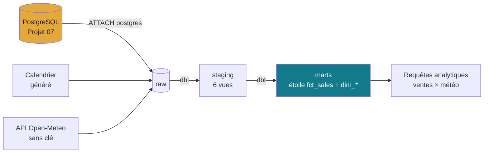

# Projet 04 — Entrepôt de données & pipeline ETL multi-sources

> Les données utiles vivent dans des systèmes séparés. Un Data Engineer les
> **centralise dans un entrepôt** modélisé pour que les analystes travaillent vite
> et juste. Ce projet ingère **3 sources hétérogènes**, les transforme en schéma en
> étoile, et les charge dans un **data warehouse interrogeable** — le tout
> orchestré et **rejouable en une commande**.

## 🧩 3 sources → 1 entrepôt (DuckDB)



| Source | Type | Extraction |
|---|---|---|
| Ventes (base du [Projet 07](https://github.com/valentinratigniet-byte/projet-07-base-ecommerce)) | Base PostgreSQL | DuckDB attache Postgres (`ATTACH … TYPE postgres`) |
| Calendrier | Générée | `generate_series` de dates |
| Météo quotidienne | API REST | Open-Meteo (archive), sans clé |

Architecture détaillée + schéma dimensionnel : **[docs/architecture.md](docs/architecture.md)**.

## ✨ Ce que le projet démontre

- **Intégration multi-sources** : DB + API + généré, réunies dans un entrepôt.
- **Modélisation dimensionnelle** : étoile `fct_sales` + `dim_date` / `dim_product` /
  `dim_customer`. `dim_date` **fusionne calendrier + météo** → on croise
  **ventes × météo** en une requête.
- **ETL medallion** : `raw` → `staging` → `marts` (dbt-duckdb), **11 tests** verts.
- **Orchestration** (Prefect) : `extract → dbt run → dbt test`, retries, logs, échec propre.
- **Pipeline rejouable en une commande.**

## ✅ Validé (exécuté)

```
Flow 'entrepot-etl' :
  ✅ extract  → 3 sources dans raw (ventes 121 331 lignes, météo 735 j)
  ✅ dbt run  → 10 modèles (6 staging + 4 marts)
  ✅ dbt test → 11 tests PASS
```
Requêtes analytiques de validation dans [`analytics/queries.sql`](analytics/queries.sql)
(CA mensuel, ventes × météo, ventes par température, top catégories).

## 🚀 Reproduire — une commande

Prérequis : base du Projet 07 lancée (Docker, port 5433) + Python.

```bash
pip install -r requirements.txt
python etl/flow.py          # extract (Postgres + calendrier + API météo) → dbt run → dbt test
```

Interroger l'entrepôt :
```bash
duckdb warehouse/warehouse.duckdb < analytics/queries.sql
```

Étape par étape :
```bash
python etl/extract.py                              # → warehouse.duckdb (schéma raw)
cd warehouse && export DBT_PROFILES_DIR=$PWD       # (Windows : set DBT_PROFILES_DIR=%CD%)
python -m dbt.cli.main run && python -m dbt.cli.main test
```

## 🗂️ Structure

```
projet-04-entrepot-donnees-etl/
├── etl/
│   ├── extract.py        ← extraction 3 sources → DuckDB (raw)
│   └── flow.py           ← orchestration Prefect (extract → dbt run → dbt test)
├── warehouse/            ← projet dbt-duckdb (entrepôt = warehouse.duckdb)
│   └── models/ staging/ + marts/ (étoile)
├── analytics/queries.sql ← requêtes de validation
└── docs/architecture.md  ← diagramme + schéma dimensionnel
```

---

*Projet 04 du [Portfolio Data](../). Cœur du profil Data Engineer : centraliser des
sources hétérogènes dans un entrepôt modélisé, orchestré et rejouable.*
