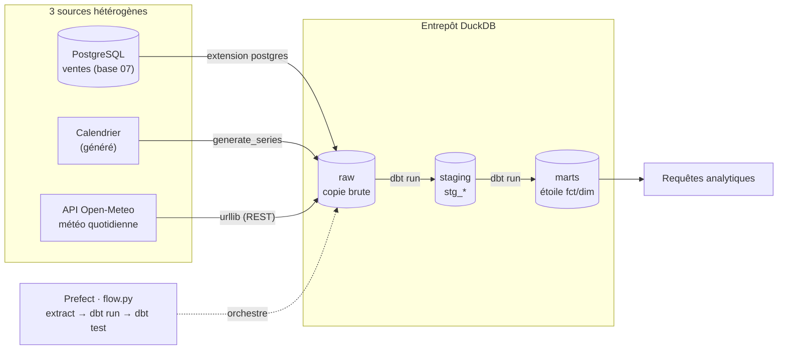

# Architecture — entrepôt de données multi-sources

## Vue d'ensemble



## Extraction (le E de ETL) — `etl/extract.py`

| Source | Type | Méthode |
|---|---|---|
| Ventes (base 07) | Base de données | DuckDB attache PostgreSQL (`ATTACH ... TYPE postgres`) |
| Calendrier | Générée | `generate_series` de dates |
| Météo | API REST | Open-Meteo (archive), sans clé, `urllib` |

Tout atterrit dans le schéma `raw` de `warehouse.duckdb`.

## Modèle dimensionnel (étoile)

```mermaid
erDiagram
    dim_date     ||--o{ fct_sales : date_key
    dim_product  ||--o{ fct_sales : product_key
    dim_customer ||--o{ fct_sales : customer_key
    fct_sales { int order_id; int customer_key; int product_key; int date_key; numeric line_amount }
    dim_date { int date_key; date date; int annee; text annee_mois; double temp_mean; double precip; bool est_pluvieux; text temp_bucket }
    dim_product { int product_key; text category; numeric price }
    dim_customer { int customer_key; text country }
```

**Point clé** : `dim_date` **fusionne 2 sources** — le calendrier généré + la météo
de l'API. Un analyste peut ainsi croiser les **ventes × météo** en une requête
(voir `analytics/queries.sql`), sans jamais toucher aux systèmes sources.

## Couches (medallion)

| Schéma | Rôle | Écrit par |
|---|---|---|
| `raw` | copie brute des 3 sources | `extract.py` |
| `staging` | nettoyage/typage (1 vue par source) | dbt (`stg_*`) |
| `marts` | étoile analytique (`fct_`/`dim_`) | dbt |

## Choix d'outillage

- **DuckDB** : entrepôt analytique embarqué, zéro serveur → pipeline rejouable **en
  une commande**, idéal pour un portfolio. *(En cloud : BigQuery free tier — même
  logique, cf. guide entrepôt central.)*
- **dbt-duckdb** : transformations versionnées + tests.
- **Prefect** : orchestration (retries, logs, échec propre).
